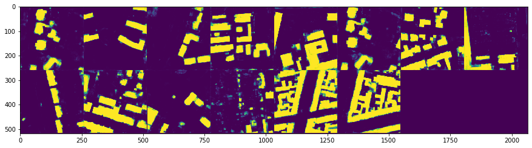

# Segmentation-deep-learning

Rooftop segmentation from satellite pictures, using a CNN. 

## Inputs and labels 

   

## Sortie de réseau 

Vue aérienne de plusieurs prises 

 

Output du réseau de la même grille de vue 

 

Carte des différence entre sortie du réseau et label

 

